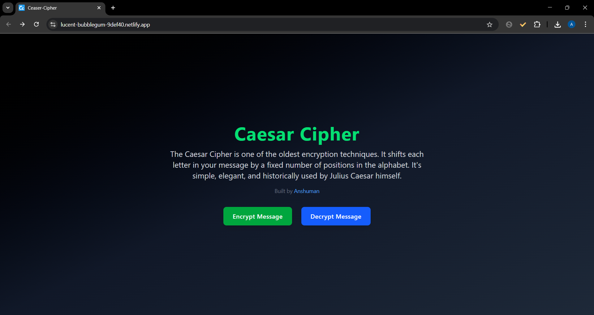
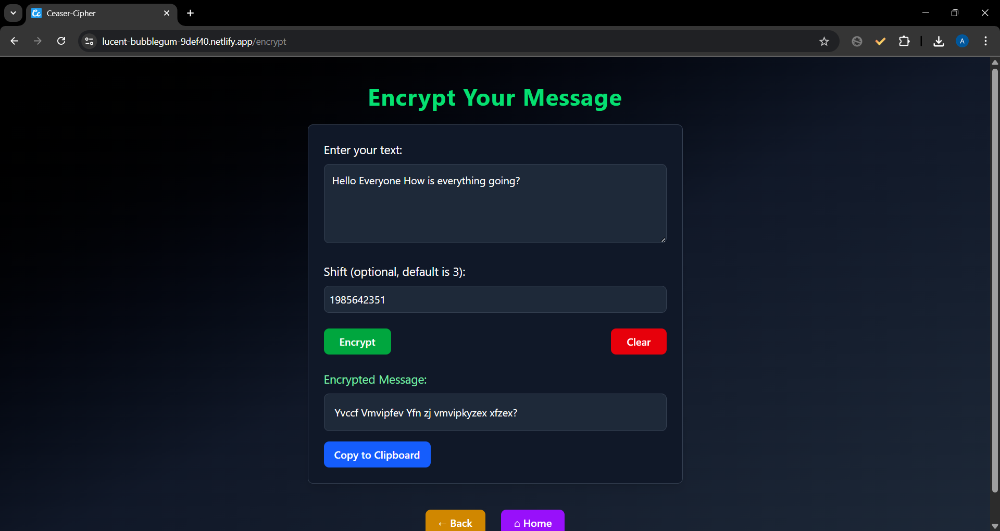
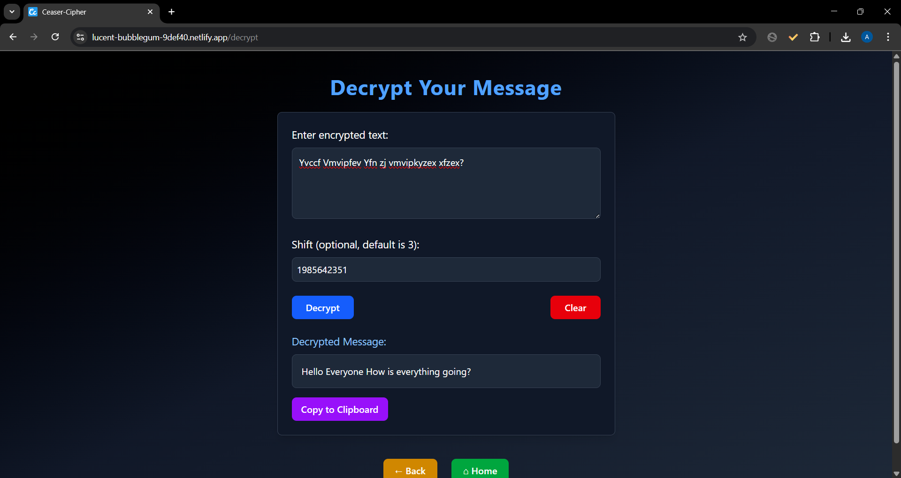

# 🔐 Caesar Cipher Frontend

A sleek and modern React.js frontend to **encrypt and decrypt messages** using the **Caesar Cipher** technique — one of the oldest known encryption algorithms, famously used by Julius Caesar.

> Built with 💙 by [Anshuman](https://github.com/cyberhypex)

---

## 🌐 Live Demo

👉 [lucent-bubblegum-9def40.netlify.app](https://lucent-bubblegum-9def40.netlify.app/)

---

## 📸 Preview

### 🏠 Home Page


### 🔒 Encrypt Message


### 🔓 Decrypt Message


---

## 🚀 Features

- Encrypt messages with a custom Caesar shift
- Decrypt previously encrypted messages
- Clean, dark-themed UI with TailwindCSS
- Clipboard copy support for results
- Responsive layout for all screen sizes

---

## 🛠 Tech Stack

- ⚛️ **React.js** – Frontend framework
- 🎨 **TailwindCSS** – Utility-first CSS for styling
- 🔗 **Axios** – HTTP client to connect with backend
- ⚡ **Vite** – Next-gen frontend tooling

---

## 📦 Installation & Running Locally

1. **Clone the repository**

```bash
git clone https://github.com/cyberhypex/ceaserCipherFrontend.git
cd ceaserCipherFrontend
